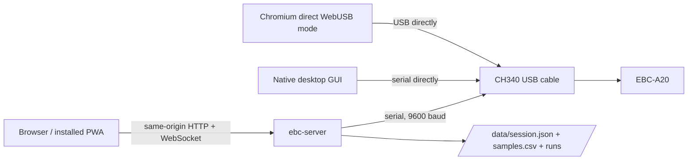

# EBC Battery Tester

Open-source control software for the ZKETECH EBC-A20 battery tester. It can run
as a persistent server with a browser UI, as a native desktop application, or
directly in a WebUSB-capable browser.


The project is written in Rust with [egui](https://github.com/emilk/egui) and
[eframe](https://github.com/emilk/egui/tree/master/crates/eframe). Native builds
are available on the [releases page](https://github.com/Kazhuu/ebc-battery-tester/releases).

## Modes

### Remote server (recommended)

The server owns the serial connection, persists measurements, serves the WASM
UI, and exposes its API on the same origin. This is the best mode for an
unattended test: closing or reloading a browser does not stop the test. Reopen
the page to reconnect to the running server.

Because the browser does not access USB in this mode, the UI works in current
Safari on iPhone, iPad, and desktop, Firefox, Chrome, Edge, and other modern
browsers. The Docker build compiles this mode as its default. HTTP, WebSocket,
and static files normally use the same origin; reverse-proxy deployments may
set `EBC_ALLOWED_ORIGIN` to one exact external origin.

### Native desktop

The default Cargo feature builds the desktop GUI. It talks to the operating
system serial port directly and is suitable when the computer remains attached.
Closing the application stops and disconnects the test during orderly shutdown.

### Direct WebUSB

Standalone Trunk builds, GitHub Pages, CI artifacts, and release archives
default to WebUSB. Add `?transport=remote` to use a same-origin server instead.
The Docker image defaults to remote mode. `?transport=webusb` and
`?transport=remote` always override the build default explicitly; a hash
override is also accepted, which is useful for an installed PWA launch.

Direct mode requires a secure context and WebUSB, currently provided by
Chromium-based desktop browsers such as Chrome and Edge. Firefox and Safari,
including iOS/iPadOS Safari, do not support direct WebUSB. The browser owns the
device in this mode, so do not close the page during a test.

## Architecture



Only one process or browser may own the device at a time. The supplied cable
contains a CH340 adapter; a plain mini-USB cable does not provide the serial
interface.

HTTP handlers and serial polling do not share an async-runtime worker: all
device lifecycle, protocol I/O, timing, and persistence are serialized by one
dedicated `ebc-device-actor` operating-system thread. HTTP requests communicate
with that single owner through messages.

## Docker

Build and run the production image:

```bash
docker build -t ebc-battery-tester .
docker run -d --name ebc-battery-tester \
  --restart unless-stopped \
  --device /dev/ttyUSB0:/dev/ttyUSB0 \
  --group-add "$(stat -c '%g' /dev/ttyUSB0)" \
  -p 8080:8080 \
  -v /srv/ebc-battery-tester:/data \
  ebc-battery-tester
```

Open `http://SERVER:8080/`. The image compiles the server without GUI/X11
dependencies and includes the Trunk-built WASM assets, CA certificates, and the
runtime `libudev` library. It does not contain a compiler, browser, VNC, or
desktop stack. Its health check calls the existing `/api/status` endpoint using
the server binary itself.

### Docker Compose and Unraid

`docker-compose.yml` defaults to Unraid's conventional UID/GID and appdata path:

```bash
SERIAL_GID="$(stat -c '%g' /dev/ttyUSB0)" docker compose up -d --build
```

The defaults are `PUID=99`, `PGID=100`, port `8080`, device `/dev/ttyUSB0`, and
host data path `/mnt/cache/appdata/ebc-battery-tester`. Override them as needed:

```bash
PUID=1000 PGID=1000 SERIAL_GID=20 EBC_DEVICE=/dev/ttyUSB1 \
EBC_PORT=8081 EBC_DATA_PATH=/mnt/user/appdata/ebc-battery-tester \
docker compose up -d --build
```

`SERIAL_GID` must be the numeric group owner of the host serial device. Obtain
it with `stat -c '%g' /dev/ttyUSB0` (or `ls -ln /dev/ttyUSB0`). Compose runs with
that supplementary group and never uses `privileged: true`.

In server/native serial mode, leave the Linux `ch341` driver attached. Do not
install an unbind udev rule: the server needs the resulting `/dev/ttyUSB*`
device. On Windows, use the normal CH340 serial driver for the native app.

## Configuration

The server accepts these environment variables:

| Variable | Default | Meaning |
| --- | --- | --- |
| `EBC_HTTP_ADDR` | `0.0.0.0:8080` | HTTP listen address |
| `EBC_SERIAL_PORT` | `/dev/ttyUSB0` | Serial device path |
| `EBC_DATA_DIR` | `/data` | Persistent state directory |
| `EBC_STATIC_DIR` | `dist` | Trunk static asset directory |
| `EBC_MOCK` | `false` | Use the simulated device |
| `EBC_ALLOWED_ORIGIN` | unset | Exact browser `Origin` accepted behind a reverse proxy |
| `RUST_LOG` | `info` in Docker | Rust log filter |

Persist `/data`. `session.json` stores the current device/test metadata,
including the current run name, and `samples.csv` stores current-run
measurements. Manual runs are archived as soon as a device report confirms
Completed or Stopped, while their current graph and immutable run ID remain
available. Continue resumes that same run; its next terminal report updates the
same archive. Cycle children are archived when the next physical run begins,
and the final child is archived when the cycle completes. Archives live under
`/data/runs/<run-id>.json` and `/data/runs/<run-id>.csv`. Run IDs are sanitized
UTC start timestamps with collision suffixes. `GET /api/runs` lists archived
runs and `GET /api/runs/<run-id>/history.csv` downloads one archive. Current history
remains available from `GET /api/history.csv`.

Cycle executions also retain an independent continuous telemetry stream under
`/data/cycles/<execution-id>.csv`; `/data/cycles/<execution-id>.json` is its
metadata sidecar and stores the execution ID/name, actual recipe snapshot,
optional saved-recipe provenance, start timestamp, and optional state, result,
elapsed milliseconds, and full-resolution sample count. Summary metadata is
written at Start and meaningful state transitions, including terminal states,
not for each device report. Terminal durations remain fixed. Restart recovery
marks nonterminal executions Interrupted with a restart reason and durable
telemetry count; it never resumes them. Saved templates are
stored independently under `/data/recipes/<recipe-id>.json`; no recipe CSVs are
created. The telemetry includes
normal mode reports from device steps, settling, rests, and repeat boundaries
without changing the per-run sample files or metrics. The latest cycle is
exported by `GET /api/cycle/history.csv`; a specific execution is exported by
`GET /api/cycles/<execution-id>/history.csv`.

The remote GUI's **History** window has **Cycles**, **Manual runs**, and
**Comparison** views,
a case-insensitive name/ID filter (also matching saved-recipe names), and a
manual **Refresh** control. Lists load on demand and remain usable while the
physical tester is disconnected or in error. Server connectivity is required.
Refresh keeps previously loaded lists, details, and comparison curves visible
while new data loads. Loading and failed requests are shown with specific retry
controls; repeated in-flight requests are coalesced.
Manual runs exclude cycle children; children appear inside their parent cycle,
ordered by repeat, step, then immutable run ID. Each child can be opened and
exported independently. Manual and cycle execution names can be edited or
cleared; cycle children remain unnamed and cannot be renamed.

Run detail shows configuration, result, duration, capacity/energy, device
identity, sample count, and selectable Voltage, Current, or derived Power plots.
Physical plots support Time, Capacity (mAh), or Energy (Wh) on the X axis and
show relevant configuration reference lines. Live physical plots have the same
selectors. Whole-cycle live and history plots support those three metrics with
Time as the only X axis. Cycle detail includes the
complete read-only recipe snapshot, saved-recipe ID/name/revision, whole-cycle
plots, and child summaries. Manual and cycle child physical runs can be added
to a transient comparison of up to four runs. The first selected run is the
baseline and can be reassigned. Comparison curve labels prefer run names and
cycle context, with immutable IDs resolving duplicates. Signed capacity and
energy differences use authoritative archived
`RunSummary` values, including when plotted curves are downsampled. Different
configuration or mode selections show informational warnings. Historical
telemetry has separate transient client
state; browsing never replaces live telemetry or changes physical execution.
Neither server history nor downloaded telemetry is serialized into GUI storage.
Direct/native/WebUSB mode retains live telemetry and explains that persistent
history requires a Remote connection to the server.

`GET /api/runs` returns the existing `Vec<RunSummary>` physical-run resource,
including cycle children. `GET /api/runs/{id}` returns
`RunHistory { summary: RunSummary, samples: Vec<Sample> }`.
`GET /api/cycles` returns `Vec<CycleSummary>`; `GET /api/cycles/{id}` returns
`CycleHistory { summary: CycleSummary, samples: Vec<CycleSample>, child_runs: Vec<RunSummary> }`.
Both detail sample arrays use the established 5000-point presentation limit,
including first/last samples and voltage, current, and power bucket extrema.
Raw CSV export retains every
sample and uses `<immutable-id>.csv` filenames (native save dialog or browser
download); server paths are never exposed. These resource routes replace the
obsolete WIP `/api/runs/{id}.csv` route without a compatibility alias.

`CycleSummary` has `execution_id: String`, `name: Option<String>`,
`recipe: Option<CycleRecipe>`, `saved_recipe: Option<SavedRecipeReference>`,
`started_at_utc: Option<String>`, `state: Option<CycleState>`,
`result: Option<String>`, `elapsed_milliseconds: Option<u64>`,
`sample_count: usize`, and `child_run_count: usize`. Optional fields deserialize
with defaults. Sidecars add optional/defaulted `state`, `result`,
`elapsed_milliseconds`, and `sample_count`; old files require no migration.
Cycle lists are newest-first by known start timestamp, then execution ID;
unknown timestamps sort last with deterministic ID ordering. Physical run lists
retain their existing descending ID order. Current executing cycles use live
authoritative status and monotonic elapsed time; terminal cycles use saved
elapsed time or the last telemetry sample.

Legacy cycle CSV files without a sidecar remain browsable, as do older minimal
sidecars. Counts and fallback elapsed time come from telemetry; unknown recipe,
provenance, start time, and terminal state remain unknown. Malformed metadata,
ID mismatches, and corrupt complete CSV rows produce errors. Reads and renames
do not regenerate telemetry or renumber samples; only the existing repair of
an incomplete final CSV row may modify a file during loading. Lists, detail
loads, renames, comparisons, and exports emit no physical device commands.
History deletion, pagination, and advanced battery-health analysis are outside
this browser.

The durable CSV retains the complete current run. Initial browser snapshots
are limited to 5000 presentation samples, and the browser remains bounded to
5000 points for the lifetime of the page. Incremental deterministic compaction
keeps the first and latest samples plus voltage/current/power extrema from time
buckets. This affects only browser memory and plotting; raw current and archived
CSV downloads remain complete. Export requests flush and sync the current CSV,
capture its durable byte length, and then stream only that prefix from an
independent file handle. A concurrent sample append therefore cannot extend or
corrupt an in-progress download, and a slow download does not block device
telemetry or commands.

Samples and test status include cumulative `energy_wh`. The server integrates
measured voltage and current with the trapezoidal rule over backend elapsed
time, but never integrates across disconnect, restart, or uncertain-ownership
gaps. The device's two-byte base-240 capacity counter is a raw `u16` value with
a 57,600 mAh modulus. During a confirmed backend-owned run, the server
normalizes plausible high-to-low wraps into a cumulative `u64 capacity_mah` and
ignores stale regressions; it does not infer a wrap across a recovery gap.
`DeviceState.capacity_mah` remains the latest raw hardware counter for
diagnostics, while samples, test status, run summaries, browser live capacity,
and CSV use the normalized cumulative value (divide by 1000 for Ah). Existing
CSV and JSON data without energy fields loads with zero energy.

After a server restart or any serial observation gap, saved history and
configuration are retained but ownership of a pending or running test is
invalidated. The test is marked `recovered_uncertain`, device activity is
unknown, and its clock is stopped. The server never automatically starts or
blindly resumes it. An active hardware report keeps the run uncertain and does
not advance backend elapsed time or energy because ownership of that interval
cannot be proven. An inactive report resolves the run to `stopped`; the user can
then start a fresh run or explicitly resume a stopped run. While recovery
remains uncertain, Start, Resume, Adjust, and Calibration are rejected; explicit
Stop and Disconnect remain available. Start and Stop are exposed as `starting`
and `stopping` until hardware reports confirm their result. Because the protocol
has no command acknowledgement, inactive reports received while Starting are
treated as potentially buffered pre-command telemetry; only an active report
confirms Start or Resume. The state remains pending until that confirmation, an
explicit Stop, or a connection gap. Normal mode reports preserve the device's
Idle and Finished states: Idle resolves an owned run to `stopped`, while Finished
resolves it to `completed`. Firmware-inactive reports do not contain that
distinction, so the server waits for the interleaved normal mode report when an
owned run ends. Disconnects,
serial errors, and uncertain recovery break the trapezoidal energy accumulator,
so neither elapsed time nor energy is invented across an observation gap. A
confirmed backend-owned start/resume starts a fresh clock at zero or resumes
from the preserved elapsed value, respectively.

Start and Calibration require telemetry from the current serial connection;
persisted or pre-disconnect voltage/activity values are never accepted as proof
that hardware is ready. All four calibration references must be staged on the
same uninterrupted connection before Confirm is accepted.

Metadata replacement and run archival use write, sync, rename, and directory
sync. Samples are append-only and flushed with `sync_data` at least once per
second while reports arrive, and are flushed on orderly stop/shutdown. On load,
one torn final CSV row is truncated; corruption in a complete row is rejected.
SIGTERM/SIGINT performs graceful actor shutdown and flushing. SIGKILL or power
loss cannot run cleanup and may lose the not-yet-synced tail (normally up to the
one-second sync interval), but previously synced rows and atomically replaced
metadata remain recoverable.

## Install on iPhone or iPad

Use the remote server URL in Safari, tap **Share**, then **Add to Home Screen**.
The installed PWA reconnects to the same server. iOS does not support direct
WebUSB, so the server and remote-default Docker UI are required. On narrow
screens the toolbar and controls reflow, Start or the active primary Stop action
appears before the graph, test settings follow it, and direct-USB selection and
connection actions use separate touch-friendly rows.

## Direct WebUSB setup

These driver changes apply only to direct WebUSB mode. Do not apply them to the
Docker server or native desktop mode.

### Windows

Use [Zadig](https://zadig.akeo.ie/) to replace the `USB Serial` device driver
with WinUSB: enable **Options > List All Devices**, select `USB Serial`, choose
WinUSB, and click **Replace Driver**. This removes the COM port until the CH340
driver is restored.


### Linux

The kernel `ch341` driver normally claims the interface. For a one-time direct
WebUSB session, identify the USB interface and unbind it, for example:

```bash
sudo sh -c 'echo "1-2.3:1.0" > /sys/bus/usb/drivers/ch341/unbind'
```

Grant the logged-in user access to USB vendor `1a86`, product `7523`, with an
appropriate udev rule. Avoid a permanent automatic unbind rule unless this host
is dedicated to WebUSB, because unbinding removes `/dev/ttyUSB0` from native and
server use.

## Mock mode

Run the complete container stack without hardware:

```bash
EBC_MOCK=true docker compose up --build
```

Or run it from source after building the web UI:

```bash
EBC_WASM_DEFAULT_TRANSPORT=remote trunk build
EBC_MOCK=true EBC_DATA_DIR=./data EBC_STATIC_DIR=./dist \
  cargo run --no-default-features --features server --bin ebc-server
```

Connect the simulated device in the browser, configure a test, and start it to
produce one sample per second.

## Build from source

Rust 1.92 or newer is required. Linux builds also need the development package
for `libudev`; desktop builds need the normal eframe/X11 or Wayland development
libraries.

```bash
# Native desktop GUI
cargo run

# WASM UI (install wasm32-unknown-unknown and Trunk first)
rustup target add wasm32-unknown-unknown
cargo install --locked trunk --version 0.21.14
trunk serve

# Production headless server binary, with no GUI feature
cargo build --release --no-default-features --features server --bin ebc-server

# All formatting, native/server/WASM checks, tests, Clippy, and Trunk build
./check.sh
```

Use `http://127.0.0.1:8080/#dev` during Trunk development. Development mode
unregisters only this app's service worker and clears only caches prefixed
`ebc-battery-tester-`. The production service worker is network-first, never
caches `/api`, derives a unique cache generation from each Trunk-generated page,
atomically populates a fresh generation, and removes only this app's older
caches after successful installation. A failed installation leaves the active
old cache in place, and no generated JS/WASM hash is hardcoded.

The project contains unit tests for validation, recovery and command races,
run/sequence client deduplication and bounds, transport selection, mobile layout
ordering, exports, and server persistence. Docker CI also runs the final image
as a non-root UID/GID with mock hardware and a persistent volume, checks health
and static hashed JS/WASM assets, exercises status/start/stop/CSV, restarts the
container, and verifies persisted API and static content. Automated tests do
not replace a real-device check.

## Real hardware checklist

1. Verify the CH340 cable appears as `/dev/ttyUSB0` and note its numeric GID.
2. Confirm no other native app, container, or WebUSB tab owns the interface.
3. Start with the tester idle and no battery/load at unsafe limits.
4. Connect and verify model, firmware, voltage, and current readings.
5. Run a short low-current discharge and confirm live samples and stop behavior.
6. Download `/api/history.csv` and verify `/data/samples.csv` after restart.
7. Start another short test, close the remote browser, reopen it, and verify the test continued.
8. Restart the server during a controlled test and verify it reports recovery as uncertain without auto-starting.
9. Interrupt and restore serial communication during Starting, Running, and Stopping; verify an active report remains uncertain and an inactive report resolves to stopped.
10. During a controlled multi-minute run, compare the tester's display and cutoff behavior with and without `0x0A` timer sync before relying on it operationally.
11. Exercise charge, constant-power, adjustment, resume, and calibration only with appropriate instrumentation and safe limits.

The available protocol documentation is ambiguous about serial parity. This
project preserves the known-working odd-parity implementation; deployment work
does not change protocol behavior.

## Machine API discovery and compatibility

Remote clients first request `GET /api/info`, without a mutation header. This
version-neutral endpoint returns static metadata directly from the running
binary, even when the tester is disconnected or the device actor is unavailable:

```json
{
  "service": "ebc-battery-tester",
  "server_version": "0.5.0",
  "api_version": 1,
  "capabilities": [
    "cycles.stop",
    "recipes.events",
    "recipes.list",
    "recipes.start",
    "state.status",
    "state.websocket"
  ]
}
```

`service` identifies EBC Battery Tester. `server_version` is the informational
application/package release; clients must **not** use it for feature detection.
`api_version` is the machine API **major compatibility version**, independent of
application releases. `capabilities` is a sorted, unique array of strings for
additive feature discovery.

Clients should check the service identifier, require a supported API major,
check capability membership for features they need, and ignore unknown
capability strings and optional JSON fields. Native remote and remote WASM GUIs
validate service and API major before opening their state WebSocket. Missing or
malformed discovery, a wrong service, or an unsupported major produces a clear
connection error without starting synchronization. Local/direct USB and WebUSB
operation do not use HTTP discovery.

The initial external-integration v1 contract covers this surface:

| Endpoint | Capability | Meaning |
| --- | --- | --- |
| `GET /api/info` | Discovery itself | Service identity and compatibility handshake |
| `GET /api/status` | `state.status` | Authoritative current snapshot |
| `GET /api/ws` | `state.websocket` | Authoritative state and telemetry event stream |
| `GET /api/recipes` | `recipes.list` | Authoritative saved-recipe library |
| WebSocket recipe events | `recipes.events` | Initial library, recipe upserts and deletions |
| `POST /api/recipes/{id}/start` | `recipes.start` | Start by immutable saved-recipe ID, capturing a server-resolved recipe/provenance snapshot |
| `POST /api/cycle/stop` | `cycles.stop` | Explicitly stop the server-owned cycle execution |

The WebSocket initially sends `Snapshot`, then `RecipeLibrary`; subsequent
state, sample, cycle-sample and recipe events maintain authoritative client
views. Clients must tolerate compatible event variants they do not recognize.
Mutating endpoints still require `X-EBC-Command: 1` and the existing origin
policy. The saved-recipe start body accepts an optional `execution_name`.
Other existing routes remain available, but are not implicitly part of this
initial external-integration compatibility commitment.

`/api/info` capabilities mean “this implementation supports this integration
feature.” `/api/status` → `capabilities` instead means “this operation is
currently allowed by authoritative device/controller state.” Static support
never changes with connection, test, cycle, or calibration state. The server
still decides whether each requested operation is currently legal.

A new machine API major is required when a change incompatibly removes a
required route or WebSocket event semantic, changes an existing contract field's
type or meaning, changes an existing request body, or changes a command's
semantics so a v1 client cannot safely use it. Adding optional JSON fields,
routes, capability strings, safely ignorable WebSocket event variants, or new
features discoverable by capability does not require a major bump. Application
releases may change freely while the compatible machine API remains v1.
`/api/info` remains the version-neutral handshake even for future majors; there
is no `/api/v1/` route tree.

## API outline

Saved recipes are reusable editable templates with immutable installation-local
IDs, required names, and optimistic-concurrency revisions. Names need not be
unique. A new recipe starts at revision 1; updating its name or complete flat
`CycleRecipe` requires the current `expected_revision` and increments the
revision once. Stale updates and deletes return `409 Conflict`.

A cycle started by saved recipe ID atomically captures the template's current
complete `CycleRecipe` and an immutable `{id, name, revision}` reference. The
execution engine uses only that snapshot and never reads the template again.
Editing or deleting a saved recipe never changes an already-started execution.
The optional execution name remains independent from the required recipe name.
Ad-hoc `/api/cycle/start` executions have no saved-recipe provenance.

Remote clients share the server library persisted under
`/data/recipes/<recipe-id>.json`. Local USB/WebUSB libraries instead remain in
the existing eframe application storage. Local and remote libraries are never
merged automatically.

Portable recipe files are ordinary single-recipe JSON with the recommended
`.ebc-recipe.json` suffix. Saved recipe IDs and revisions are local to one
installation. Portable files contain no installation-specific identity. Import
always creates a new saved recipe with a fresh ID, revision 1, and new local
timestamps, even when the name or contents duplicate an existing recipe.

Version 1 uses the existing flat recipe language:

```json
{
  "format": "ebc-battery-tester-recipe",
  "version": 1,
  "name": "4.2 V capacity test",
  "recipe": {
    "steps": [
      {
        "type": "device",
        "config": {
          "mode": "discharge_constant_current",
          "current_ma": 500,
          "cutoff_voltage_mv": 3000,
          "cutoff_time_min": 0
        },
        "completion": "hardware"
      },
      {
        "type": "rest",
        "duration_seconds": 60
      }
    ],
    "repeat_count": 1
  }
}
```

Manual runs have an immutable, server-assigned `run_id`; cycle executions have
an immutable, server-assigned `execution_id`. Their optional names are editable,
need not be unique, and may be cleared without changing either ID. A cycle's
device-step child runs are linked to their parent by `CycleRunContext` and always
have `name: null`. Saved recipe names and execution names are not part of
`CycleRecipe`.

The canonical manual start body wraps the test configuration and optional name:

```json
{
  "config": {
    "mode": "discharge_constant_current",
    "current_ma": 1000,
    "cutoff_voltage_mv": 3000,
    "cutoff_time_min": 0
  },
  "name": "Cell A capacity"
}
```

The canonical cycle start body similarly wraps the recipe and execution name:

```json
{
  "recipe": {
    "steps": [
      {
        "type": "rest",
        "duration_seconds": 60
      }
    ],
    "repeat_count": 1
  },
  "name": "Formation pass"
}
```

Rename a manual run with `POST /api/runs/{run_id}/name` or a cycle execution
with `POST /api/cycles/{execution_id}/name`. Both accept `{"name":"New name"}`;
send `{"name":null}` or an empty/whitespace-only string to clear the name.

All endpoints are under `/api`:

| Method | Path | Purpose |
| --- | --- | --- |
| `GET` | `/api/info` | Static machine API identity, version and capabilities |
| `GET` | `/api/status` | Current authoritative snapshot |
| `GET` | `/api/history` | Measurement history as JSON |
| `GET` | `/api/history.csv` | Measurement history as CSV |
| `GET` | `/api/runs` | Archived run summaries |
| `GET` | `/api/runs/{id}` | Run summary and bounded presentation samples |
| `GET` | `/api/runs/{id}/history.csv` | Full-resolution archived run CSV |
| `GET` | `/api/cycles` | Execution summaries, including the current cycle |
| `GET` | `/api/cycles/{id}` | Cycle summary, bounded samples, and child run summaries |
| `GET` | `/api/cycle/history.csv` | Current/latest full-resolution cycle telemetry |
| `GET` | `/api/cycles/{id}/history.csv` | Cycle telemetry by execution ID |
| `GET` | `/api/ws` | Snapshot/sample/cycle-sample WebSocket stream |
| `GET` | `/api/recipes` | Full authoritative saved-recipe library |
| `POST` | `/api/recipes` | Create a saved recipe |
| `PUT` | `/api/recipes/{recipe_id}` | Update name and recipe with `expected_revision` |
| `DELETE` | `/api/recipes/{recipe_id}` | Delete with `expected_revision` |
| `POST` | `/api/recipes/{recipe_id}/start` | Start the actor-resolved saved recipe with optional `execution_name` |
| `GET` | `/api/recipes/{recipe_id}/export` | Download portable version-1 JSON |
| `POST` | `/api/recipes/import` | Import portable JSON as a new local identity |
| `POST` | `/api/connect`, `/api/disconnect` | Serial connection control |
| `POST` | `/api/test/start` | `StartTestRequest` JSON envelope (`config` and optional `name`) |
| `POST` | `/api/test/adjust` | Raw test configuration JSON |
| `POST` | `/api/test/stop`, `/api/test/resume` | Test lifecycle |
| `POST` | `/api/cycle/start` | `StartCycleRequest` JSON envelope (`recipe` and optional `name`) |
| `POST` | `/api/cycle/stop` | Stop the active cycle execution |
| `POST` | `/api/runs/{run_id}/name` | Rename or clear a manual run name |
| `POST` | `/api/cycles/{execution_id}/name` | Rename or clear any persisted cycle execution name |
| `POST` | `/api/calibration` | JSON calibration command |

Every mutating `POST`, `PUT`, and `DELETE` requires `X-EBC-Command: 1`; the remote UI sends it and API
errors are displayed in the connection panel. Browser WebSockets require an
`Origin`. By default an HTTP or HTTPS origin must match `Host`; when TLS terminates or
the public host differs at a reverse proxy, set `EBC_ALLOWED_ORIGIN` to the exact
external value such as `https://battery.example.com`. Forward the original
`Origin`, support WebSocket upgrades, and do not strip `X-EBC-Command`.

The custom header and origin checks reduce accidental cross-site commands but
are not authentication or authorization. Treat the server as a hardware control
endpoint: expose it only on a trusted LAN, or place it behind an HTTPS reverse
proxy with authentication and WebSocket support. Do not publish port 8080
directly to the internet.

## Current limitations

- One device per process.
- No software capacity/percentage completion targets, internal-resistance test,
  plot image export, imported CSV/`.dat` replay,
  firmware update, or support guarantee for models other than EBC-A20.
- Server recovery is conservative and does not automatically restart a test.

## Protocol and firmware research

- [Frame reference](FRAMES.md)
- [Reverse-engineering notes](REVERSE_ENGINEERING.md)
- `extract_firmware_from_exe.py` extracts firmware images from the original
  Windows executable.
- `extract_firmware.py firmware-update.pcap firmware_extracted.bin` reconstructs
  an image from a USB capture.

The firmware files are not distributed by this project. The protocol work began
from the [ZKETECH EBC-A20 reverse-engineering article](https://pop.fsck.pl/hardware/zketech-ebc-a20.html)
and the [WebUsbSerialTerminal CH340 implementation](https://github.com/selevo/WebUsbSerialTerminal/blob/main/serial.js).

This project was featured by
[Hackaday](https://hackaday.com/2026/06/18/battery-tester-gets-an-app-upgrade/).
